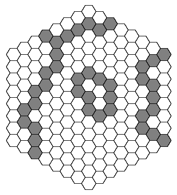

## Règles

Jeu Havannah

1. Les joueurs jouent a tour de role, Noir commence.
2. A son tour, un joueur place une piece sur une case vide ou passe.
3. Le plateau est hexagonal (taille 5). Toutes les cases sont jouables.
4. Au d'ebut de la partie, 10 gemmes sont placees aleatoirement, face cachee (une par case
maximum).
5. Il existe deux types de gemmes :
simple (+1 point),
rare (+2 points)
6. Objectif : obtenir le plus de points.
7. Une structure est formee lorsqu’un joueur cree :
un triangle (3 cases adjacentes),
une ligne (5 cases alignees),
une etoile (6 cases autour d’une case centrale).
8. Une structure completee devient active.
9. Une structure active est declenchee seulement si elle est reliee a une autre structure du
joueur ou si plusieurs structures sont formees au meme tour.
10. Lorsqu’une structure est declenchee, toutes les structures connectees du joueur sont
egalement declenchees (reaction en chaine).
11. Les structures declenchees revelent des gemmes :
triangle : case adjacente choisie aleatoirement,
ligne : cases adjacentes,
etoile : case centrale.
12. Si plusieurs structures revelent une meme case, la gemme compte double.
13. Une structure ne peut etre declenchee qu’une seule fois et reste sur le plateau.
14. La partie se termine lorsque toutes les gemmes sont prises ou si les deux joueurs passent
deux fois. Le joueur avec le plus de points gagne.
15. En cas d’egalite, la partie est declaree nulle.

